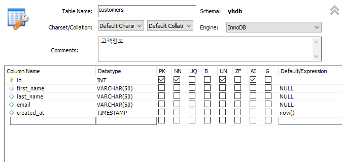
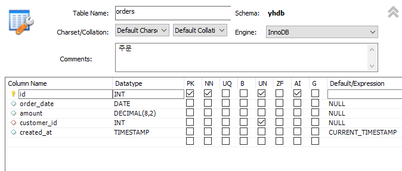
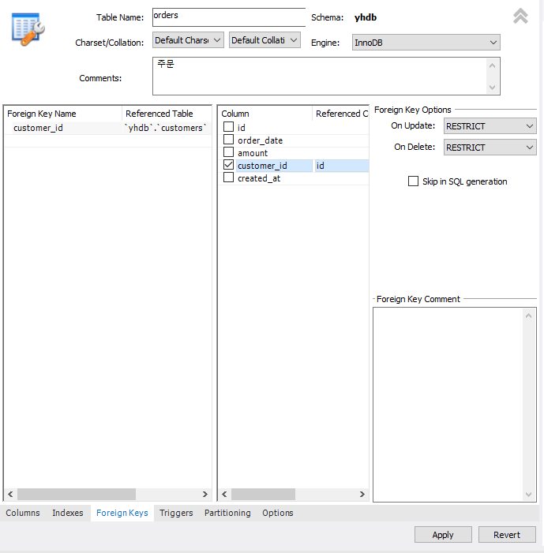

# join
## 테이블 생성
### customers 테이블
  
### customers를 참조하는 테이블 생성
  
  

## 코드
```SQL
-- 두 테이블을 하나로 합쳐서 가져오시오. 
select *
from orders
join customers
on orders.customer_id = customers.id;

-- 테이블의 이름을 줄여서 사용하는 방법
select *
from orders as o
join customers as c
on o.customer_id = c.id;

-- 중복된 컬럼이름을 변경해야 한다.
select o.id as order_id, order_date, amount, 
		o.created_at, c.id as customer_id, first_name, last_name, email -- select는 거의 마지막에 실행돼서 밑에 o를 써도 됨.
from orders as o
join customers as c
on o.customer_id = c.id;
```

### 모든 고객 데이터를 가져오되, 주문 정보가 없는 고객도 나타나도록 가져오는 방법

```SQL
select *
from customers c
left join orders o
on c.id = o.customer_id;

select *
from orders o
right join customers c
on c.id = o.customer_id;
```

### 예제
- 2019년 12월 20일부터 2020년 1월 10일 사이의 데어터에서 고객별 주문금액 평균이 300달러 이상인 사람의 이름과 평규늠액을 가져오시오.
```SQL
select c.id as customer_id, first_name, avg(amount) as avg_amount
from orders as o
join customers as c
on o.customer_id = c.id
where order_date >= '2019-12-20' and order_date <= '2020-01-10'
group by customer_id having avg_amount >= 300
order by avg_amount desc;
```

- 리뷰되지 않은 시리즈의 제목을 가져오시오.
```SQL
select title as unreviewed_series
from series s
left join reviews r
on s.id = r.series_id
where r.rating is null;
```

## 참조된 값 지우기
- papers가 students를 참조한다.

### 참조하는 데이터를 먼저 삭제
```SQL
delete students
where id = 1; -- 에러
-- students.id = 1인걸 지우지 못함.
-- papers에서 참조하고 있기 때문에 못함.
-- papers에서 student_id가 1인걸 먼저 다 삭제한 뒤에 
-- student의 id가 1인걸 삭제하는게 순서 
delete papers
where student_id = 1; -- papers 먼저 삭제
delete students
where id = 1;
```
### foreign을 수정해 삭제
- foreign option의 on delete를 cascade로 바꾸면 students에서 id를 바로 삭제할 수 있고 papers에서 students를 참조하던 데이터도 같이 삭제됨.