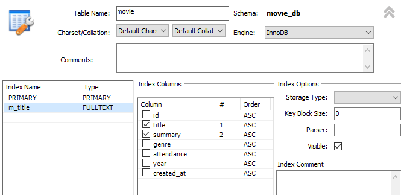

# 영화리뷰앱 DB 만들기
## 만드는 순서
- 1. 회원가입하는 SQL
- 2. 하트 눌러서 즐겨찾기에 저장하는 SQL
- 3. 내 즐겨찾기 리스트 가져오는 SQL
- 4. 리뷰 저장 / 수정 / 삭제하는 SQL
- 4-1. 내가 작성한 리뷰 리스트 가져오는 SQL
- 5. 영화제목 검색하여 영화목록 가져오는 SQL
- 6. 해당 영화에 대한 리뷰 리스트 가져오는 SQL
- 7. 영화 상세 정보 가져오는 SQL
- 8. 메인페이지의 영화 리스트 가져오는 SQL(좋아요한 정보도 표시)

## DB 만들기
### 회원가입
```SQL
-- 회원가입 페이지
insert into user
(email, password, name, gender)
values
('abc@naver.com', '1234', '홍길동', 1);

-- 회원가입 확인
select *
from user
order by id desc;
-- id 301로 저장됨. 
```

### 즐겨찾기 기능
```SQL
insert into favorite
(user_id, movie_id)
values
(301, 1);

delete from favorite
where user_id = 301 and movie_id = 1;
```

### 리뷰 저장 / 수정 / 삭제
```SQL
insert into review
(movie_id, content, user_id, rating)
values
(1, '너무 재밌어요!', 301, 5);
-- id 1001번째 리뷰로 잘 들어감

update review
set rating = 4, content = '정말 재밌어요!'
where id = 1001;
-- 복수 업데이트는 ,로 추가.

delete from review
where id = 1001 and user_id = 301;
```

### 내 즐겨찾기 리스트 가져오기
```SQL
select m.title, count(r.id) as review_cnt, avg(r.rating) as rating_avg
from favorite f
join movie m
on f.movie_id = m.id
left join review r -- left를 안하면 리뷰가 없는 영화의 title을 못 가져옴.
on f.movie_id = r.movie_id
where f.user_id = 301
group by f.movie_id;
```

### 영화 상세정보 페이지
```SQL
select m.*, ifnull(avg(r.rating), 0) as avg_rating, count(r.id) as review_cnt
from movie m 
left join review r
on m.id = r.movie_id
where m.id = 31;
```

### 영화 제목 검색
```SQL
-- 영화 제목 검색 
insert into history
(user_id, word)
values
(301, 'sun');

-- 검색기록
select word
from history
where user_id = 301
order by created_at desc; -- 최근 검색기록부터 나오도록

-- 검색결과
select title, count(r.id) as review_cnt, 
	ifnull(avg(r.rating), 0) as avg_rating
from movie m
left join review r
on m.id = r.movie_id
where m.title like '%sun%'
group by m.id;

-- 영화 제목 또는 영화 줄거리에 들어있는 것도 포함돼서 검색되도록.
select title, count(r.id) as review_cnt, 
	ifnull(avg(r.rating), 0) as avg_rating
from movie m
left join review r
on m.id = r.movie_id
where m.title like '%sun%' or m.summary like '%sun%'
group by m.id;
```
- 위에서부터 아래로 데이터를 찾는거를 풀스크린이라 함(느림)
- movie테이블에서 title이랑 summary에 인덱스 걸기 
- fulltext해두면 문자열 검색이 빨라짐.  


### 내 정보(유저정보, 리뷰리스트(영화이름, 별점))
```SQL
select email, name, gender
from user
where id = 301;

select m.id as movie_id, r.id as review_id, title, rating
from review r
join movie m
on r.movie_id = m.id
where user_id = 1;
```

### 영화 하나를 탭하면 해당 영화 리뷰정보를 보여주는 화면
- 최근 작성한 리뷰 순으로 25개씩 가져오도록
- 유저, 내용, 별점
```SQL
select u.name, r.content, r.rating
from review r
join user u
on r.user_id = u.id
where r.movie_id = 10
order by r.created_at desc
limit 0, 25;
```

### 메인화면
- movie, review, favorite 보이기
- 25개씩 리뷰갯수 내림차순 or 별점평균 내림차순
#### 내 답
```SQL
select title, count(m.id) as review_cnt,
	ifnull(avg(rating), 0) as avg_rating,
	if(f.user_id = 301, 1, 0) as favorite
from movie m
left join review r
	on m.id = r.movie_id
left join favorite f
	on m.id = f.movie_id
group by m.id
order by review_cnt desc -- 리뷰 갯수 정렬
limit 0, 25;
```
#### 강사님 답
```SQL
select title, count(r.id) as review_cnt,
	ifnull(avg(r.rating), 0) as avg_rating,
    if(f.id is not null, 1, 0) as is_favorite
from movie m
left join review r
	on m.id = r.movie_id
left join favorite f
	on m.id = f.movie_id and f.user_id = 301 -- 조인을 할 때 user_id가 301인 사람만 조인
group by m.id
order by avg_rating desc
limit 0, 25;
```

### 테이블 생성
```SQL
CREATE DATABASE `movie_db` /*!40100 DEFAULT CHARACTER SET utf8mb3 COLLATE utf8mb3_unicode_ci */ /*!80016 DEFAULT ENCRYPTION='N' */;
CREATE TABLE `favorite` (
  `id` int unsigned NOT NULL AUTO_INCREMENT,
  `movie_id` int unsigned DEFAULT NULL,
  `user_id` int unsigned DEFAULT NULL,
  `created_at` timestamp NULL DEFAULT CURRENT_TIMESTAMP,
  PRIMARY KEY (`id`),
  UNIQUE KEY `f_userId_movieId` (`user_id`,`movie_id`) /*!80000 INVISIBLE */,
  KEY `f_movie_id_idx` (`movie_id`),
  CONSTRAINT `f_movie_id` FOREIGN KEY (`movie_id`) REFERENCES `movie` (`id`),
  CONSTRAINT `f_user_id` FOREIGN KEY (`user_id`) REFERENCES `user` (`id`)
) ENGINE=InnoDB AUTO_INCREMENT=7 DEFAULT CHARSET=utf8mb3 COLLATE=utf8mb3_unicode_ci;
CREATE TABLE `history` (
  `id` int unsigned NOT NULL AUTO_INCREMENT,
  `user_id` int unsigned DEFAULT NULL,
  `word` varchar(100) COLLATE utf8mb3_unicode_ci DEFAULT NULL,
  `created_at` timestamp NULL DEFAULT CURRENT_TIMESTAMP,
  PRIMARY KEY (`id`),
  KEY `history_user_id_idx` (`user_id`),
  CONSTRAINT `h_user_id` FOREIGN KEY (`user_id`) REFERENCES `user` (`id`)
) ENGINE=InnoDB DEFAULT CHARSET=utf8mb3 COLLATE=utf8mb3_unicode_ci;
CREATE TABLE `movie` (
  `id` int unsigned NOT NULL AUTO_INCREMENT,
  `title` varchar(100) COLLATE utf8mb3_unicode_ci DEFAULT NULL,
  `summary` varchar(300) COLLATE utf8mb3_unicode_ci DEFAULT NULL,
  `genre` varchar(100) COLLATE utf8mb3_unicode_ci DEFAULT NULL,
  `attendance` int DEFAULT NULL,
  `year` timestamp NULL DEFAULT NULL,
  `created_at` timestamp NULL DEFAULT CURRENT_TIMESTAMP,
  PRIMARY KEY (`id`),
  FULLTEXT KEY `m_title` (`title`,`summary`)
) ENGINE=InnoDB AUTO_INCREMENT=1001 DEFAULT CHARSET=utf8mb3 COLLATE=utf8mb3_unicode_ci;
CREATE TABLE `review` (
  `id` int unsigned NOT NULL AUTO_INCREMENT,
  `movie_id` int unsigned DEFAULT NULL,
  `user_id` int unsigned DEFAULT NULL,
  `rating` tinyint DEFAULT NULL,
  `content` varchar(256) COLLATE utf8mb3_unicode_ci DEFAULT NULL,
  `created_at` timestamp NULL DEFAULT CURRENT_TIMESTAMP,
  `update_at` timestamp NULL DEFAULT CURRENT_TIMESTAMP ON UPDATE CURRENT_TIMESTAMP,
  PRIMARY KEY (`id`),
  KEY `r_user_id_idx` (`user_id`),
  KEY `r_movie_id_idx` (`movie_id`),
  CONSTRAINT `r_movie_id` FOREIGN KEY (`movie_id`) REFERENCES `movie` (`id`),
  CONSTRAINT `r_user_id` FOREIGN KEY (`user_id`) REFERENCES `user` (`id`)
) ENGINE=InnoDB AUTO_INCREMENT=1002 DEFAULT CHARSET=utf8mb3 COLLATE=utf8mb3_unicode_ci;
CREATE TABLE `user` (
  `id` int unsigned NOT NULL AUTO_INCREMENT,
  `email` varchar(256) COLLATE utf8mb3_unicode_ci DEFAULT NULL,
  `password` varchar(256) COLLATE utf8mb3_unicode_ci DEFAULT NULL,
  `name` varchar(256) COLLATE utf8mb3_unicode_ci DEFAULT NULL,
  `gender` tinyint DEFAULT NULL COMMENT '0 여자, 1 남자',
  `created_at` timestamp NULL DEFAULT CURRENT_TIMESTAMP,
  PRIMARY KEY (`id`)
) ENGINE=InnoDB AUTO_INCREMENT=302 DEFAULT CHARSET=utf8mb3 COLLATE=utf8mb3_unicode_ci;
```