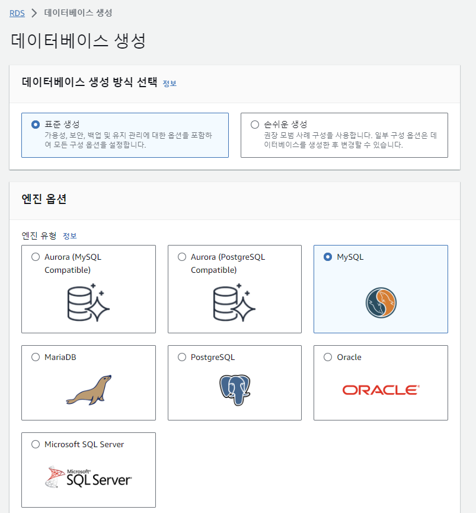
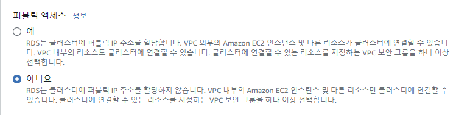
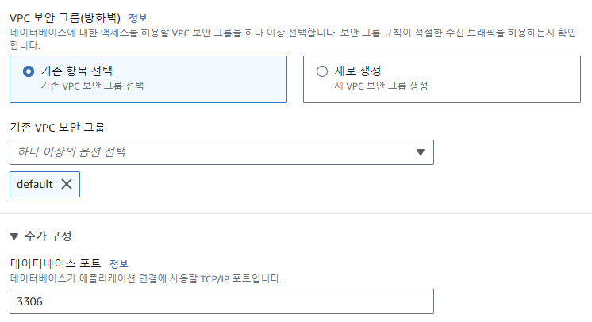
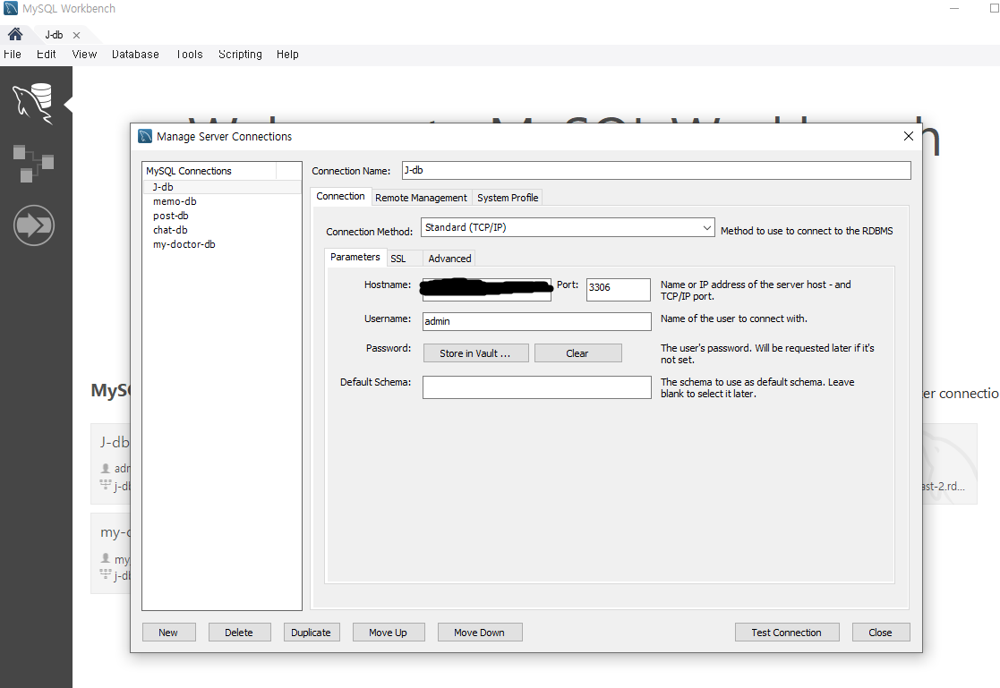

# db 생성
## 1.

- ec2 rds에서 생성
- 실무에선 오로라(or 오라클) sql 쓰지만  
무료가 아니라서 연습은 mysql로
- 프리티어로 만들면 웬만한거 안 건드려도 됨.

## 2.

- 마스터사용자이름 admin
- 퍼블릭 억세스 가능 '예'로 선택

## 3.

- 데이터베이스 포트 보통 회사에서는 바꿈

## 4.

- sql workbench 설치하고 들어가기
- 커넥션 네임을 본인이 알아볼 수 있게(J-db)
- 호스트네임을 RDS의 엔드포인트를 복붙
- 유저네임에 admin을 적고  
그 밑에 Store in Vault버튼을 눌러 비번 적기
- 포트는 db 생성시 설정한 포트로.

## AWS 방화벽 설정
- 인바운드 규칙
- 사용자지정 TCP도 되지만  
mysql/aurora로 3306 지정
  
____________
# db 용어
db에서 2차원 행렬은 테이블이라고 함.  
똑같이 컬럼은 컬럼이라 하지만 인덱스는 없음  
실제 데이터는 행으로 되어있음(dataframe이랑 같음)  
  
데이터페이스는 많은 테이블들로 이뤄져있음  
예를 들면 유저라는 테이블은 아이디, 비밀번호, 이메일 등이 있고  
상품이라는 테이블은 상품 이름이랑 가격이 있음.  
  
테이블간 관계가 정리되어 있음 (이런걸 관계형 데이터베이스) (RDBMS)  
RDBMS의 대표적인 예로는 MySQL  
  
반대로 NoSQL은 비관계형 데이터베이스의 대표예  
  
테이블 만드는걸 테이블 설계라 함.

## 테이블설계 예시
```
온라인 구매사이트 테이블설계 예시

유저정보
- id
- 이메일
- 이름
- 전화번호
- 집주소
- 성별
- 나이

제품정보
- id
- 제품명
- 가격

주문내역
- 제품명/가격 ( 제품 id로) (이런식으로 테이블을 연결하는걸 레퍼런스(참조)하고 있다고 함.)
- 주문한 사람의 정보(이름/전화번호/주소) (회원가입 id로) (이런식으로 참조하는 키를 foreign key라고 함)
- 주문날짜
- 주문 수량
```
